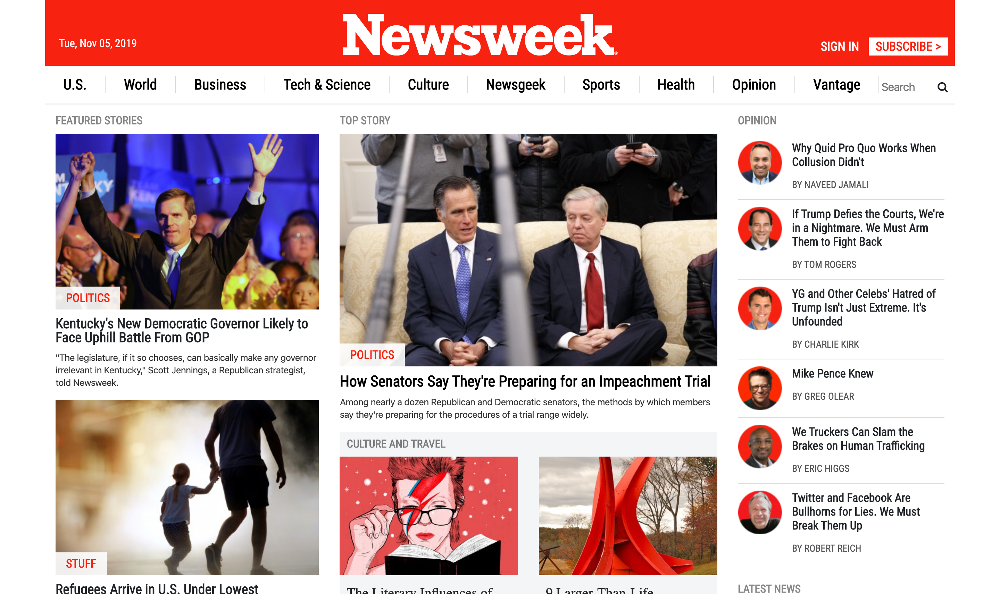
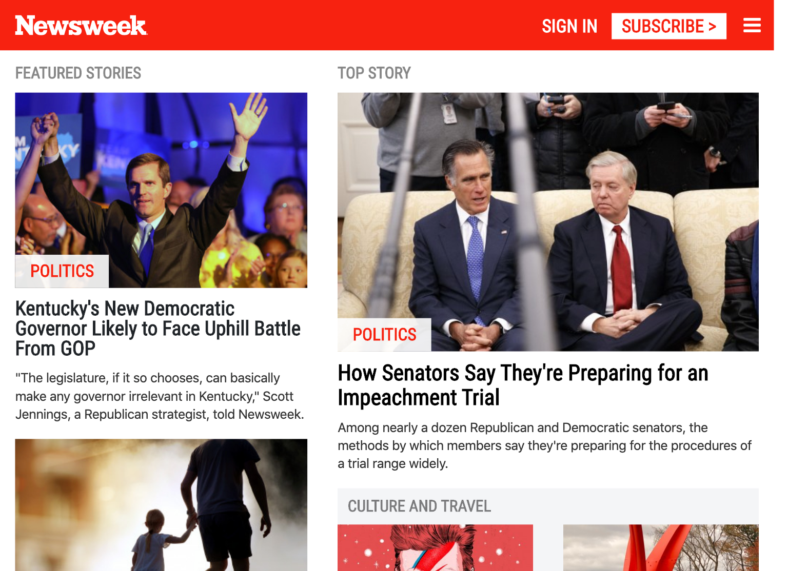
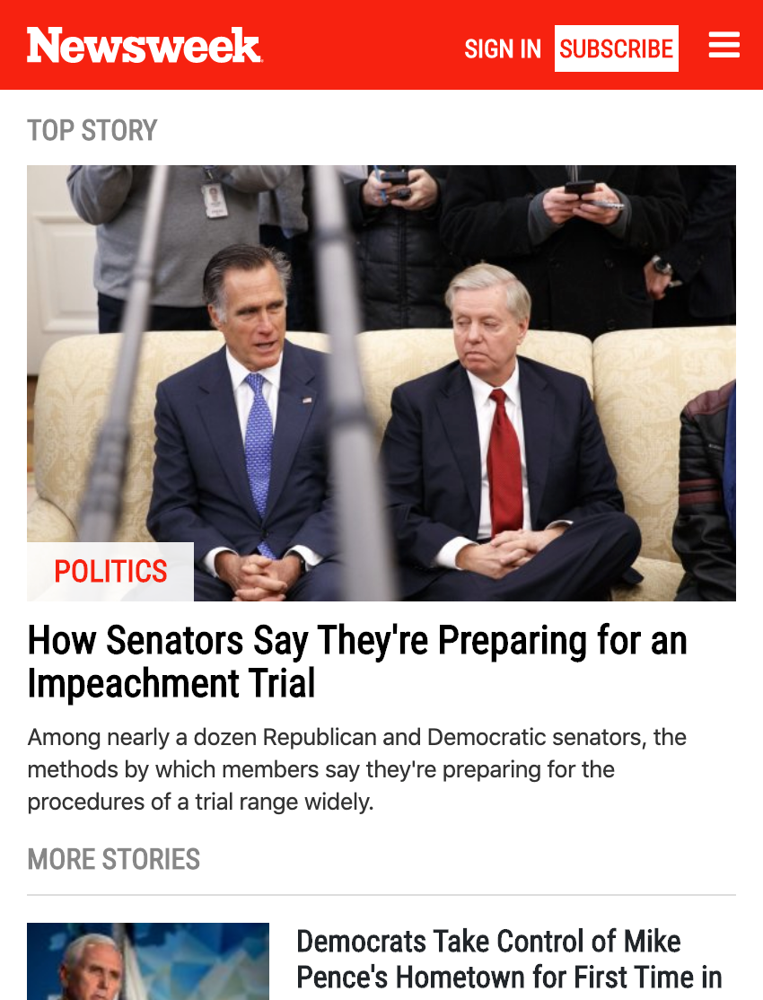

# Using Bootstrap

|||
| ------------- | ------------- |
|   |   |

The project consists in making a clone of the [Newsweek website](https://www.newsweek.com) using Bootstrap.

## Technologies used

- HTML5
- CSS3
- Bootstrap

## Live view

A live view can be found [here](https://raw.githack.com/elshaka/Using-Bootstrap/master/index.html).

## Author

👤 **Eleazar Meza**

- Github: [@elshaka](https://github.com/elshaka)
- Twitter: [@elshaka](https://twitter.com/elshaka)
- Linkedin: [Eleazar Meza](https://www.linkedin.com/in/elshaka/)

